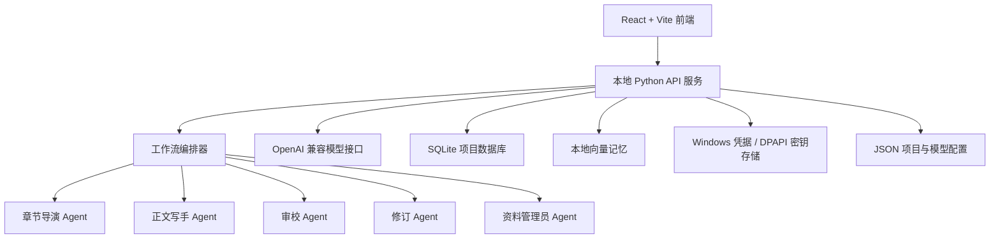

# NovelFlow AI 小说写作平台

## 技术架构与产品能力说明

版本：本地 MVP / 技术验证版  
日期：2026-08-15

---

## 1. 产品定位

NovelFlow 不是普通的聊天机器人，而是一套面向小说创作者的本地化 AI 长篇写作工作台。

平台的核心流程是：

1. 建立作品档案；
2. 规划故事路线；
3. 按章节生成正文；
4. 保存人物、时间线、伏笔和世界观；
5. 对章节进行审校与修订；
6. 将本章结果提取为后续章节可检索的长期记忆。

平台的核心竞争力不是“一次生成一篇小说”，而是长期记忆、跨章节一致性追踪、伏笔生命周期管理和 Agent 协作写作。

当前产品等级：可运行的本地单用户产品 / 技术验证版，不是完整商业化 SaaS。

---

## 2. 总体架构



默认服务地址：

- 前端：`127.0.0.1:4173`
- 后端：`127.0.0.1:8787`

前端通过 Vite 将 `/api` 请求代理到本地 Python 后端。浏览器不直接访问模型密钥。

---

## 3. 前端技术栈与模块

### 3.1 技术栈

- React 19
- Vite 8
- JavaScript / JSX
- `lucide-react`
- Oxlint
- CSS 响应式布局

### 3.2 主要文件

- `web-ui/src/App.jsx`：应用状态、路由视图、API 调用和主要交互
- `web-ui/src/App.css`：整体视觉样式和布局
- `web-ui/src/QuickCreateModal.jsx`：快速创作
- `web-ui/src/NewProjectWizard.jsx`：新建作品向导
- `web-ui/src/StoryControlPanel.jsx`：故事控制台
- `web-ui/src/StoryMap.jsx`：故事结构和章节地图

### 3.3 主要页面能力

1. **作品首页**：作品列表、创作进度、章节数量和最近活动。
2. **快速创作**：面向新手，输入想法、题材、篇幅和风格，生成多个故事方向。
3. **新建作品向导**：设置作品名、题材、主角、目标、风格、章节数量和每章字数。
4. **灵感助手**：结合当前作品和用户输入，生成动态故事方向。
5. **专业创作台**：管理大纲、人物、世界观、伏笔、时间线和章节规划。
6. **写作房间**：编辑章节，支持自动保存、草稿恢复、版本对比和定稿。
7. **AI 编辑团队**：启动章节级 Agent 工作流。
8. **右侧创作助手**：作为创作 Chatbot 讨论剧情、人物、冲突和续写方向，并支持部分建议填入工作流。

---

## 4. 后端技术栈与职责

主要文件：

- `api_server.py`
- `agent_skills.py`
- `novelflow_storage.py`
- `novelflow_secrets.py`
- `novelflow_vector_memory.py`

后端技术：

- Python 3.11
- `http.server.ThreadingHTTPServer`
- `httpx`
- OpenAI Python SDK
- SQLite
- Chroma 本地向量数据库
- Windows Credential Manager / DPAPI

后端主要职责：

- 接收和校验前端请求；
- 调用 OpenAI 兼容模型接口；
- 执行 Agent 工作流；
- 保存项目、章节和版本；
- 提取并检索长期记忆；
- 处理超时、网络错误、模型格式错误和降级恢复；
- 返回结构化结果和任务状态。

当前后端是轻量级本地 HTTP 服务，不是 Django、FastAPI 或云端微服务架构。

---

## 5. 主要 API 分组

### 项目管理

```text
GET  /api/project
GET  /api/projects
POST /api/project/create
POST /api/projects/select
POST /api/projects/remove
POST /api/projects/restore
POST /api/projects/export
```

### 章节管理

```text
POST /api/project/chapters/create
POST /api/project/chapters/save
POST /api/project/chapters/finalize
POST /api/project/chapters/plan
POST /api/project/chapters/plan/generate
POST /api/chapter/continue
```

### Agent 工作流

```text
POST /api/workflow/run
POST /api/workflow/apply
POST /api/workflow/cancel
GET  /api/workflow/tasks
```

### 创作助手与灵感

```text
POST /api/assistant
POST /api/assistant/action-preview
POST /api/inspiration
```

### 模型管理

```text
GET  /api/models
POST /api/models/configure
POST /api/models/test
POST /api/models/remove
GET  /api/security
```

### 记忆与一致性

```text
POST /api/project/memory/search
POST /api/project/continuity/save
POST /api/project/consistency
POST /api/project/chapters/memory-preview
```

---

## 6. Agent 架构

当前核心 Agent 大约 11 个：

| Agent | 主要职责 |
|---|---|
| 作品总编 | 管理作品总方向、长期目标和偏离风险 |
| 剧情弧设计师 | 设计阶段目标、转折和阶段结尾 |
| 世界观校验 | 检查规则、时间线和世界机制 |
| 剧情策划 | 设计章节推进、冲突和信息释放 |
| 人物导演 | 管理人物状态、关系和行为逻辑 |
| 伏笔编辑 | 管理伏笔埋设、推进和回收 |
| 章节导演 | 设计本章目标、场景、冲突和结尾钩子 |
| 正文写手 | 根据上下文和章节规划生成正文 |
| 终审编辑 | 检查逻辑、人物、节奏、重复和空洞问题 |
| 修订写手 | 根据审校意见重写正文 |
| 资料管理员 | 提取事实、人物状态、伏笔和时间线 |

默认的逐章工作流使用 5 个 Agent：

```text
章节导演 -> 正文写手 -> 终审编辑 -> 修订写手 -> 资料管理员
```

代码 ID：

```text
director
writer
review
reviser
librarian
```

这里的“多 Agent”目前是有顺序的协作流水线，不是多个模型实时对话，也不是分布式 Agent 集群。每个 Agent 接收自己的角色提示词和结构化上下文，完成单一职责后把结果传给下一个 Agent。

---

## 7. Skills 体系

当前 Skills 主要定义在 `agent_skills.py` 中，不是运行时从 GitHub 动态下载的插件。

### 7.1 Agent 职责 Skills

每个 Agent 都有：

- `id`
- `label`
- `instruction`
- `version`
- `schemaVersion`

这些 Skills 规定 Agent 的工作边界，例如人物一致性、章节节奏、伏笔管理、审校规则和记忆提取方式。

### 7.2 题材包 Skills

当前题材配置分为：

- 题材类型
- 受众与情绪
- 世界机制
- 写法节奏
- 篇幅模式

可覆盖悬疑推理、玄幻升级、都市情感、无限流、群像冒险、系统、重生、副本、探案、快节奏、慢热沉浸、强钩子和硬核逻辑等方向。

### 7.3 系统级约束

模型还会接收到：

- 当前章节目标
- 作品核心冲突
- 主角目标
- 前文事实
- 人物状态
- 世界规则
- 已埋伏笔
- 时间线
- 章节字数范围
- 长篇 / 中篇 / 短篇模式

因此模型收到的不是简单的“帮我写小说”，而是一组作品级和章节级约束。

---

## 8. 章节生成流程

以生成第二章为例：

1. 用户点击生成章节。
2. 前端提交章节目标、作品 ID 和模型配置。
3. 后端读取前文摘要、人物、伏笔、时间线和相关检索证据。
4. 章节导演生成本章结构。
5. 正文写手根据结构生成初稿。
6. 终审编辑检查逻辑、人物、节奏和重复。
7. 修订写手根据审校意见生成修订稿。
8. 资料管理员提取本章记忆。
9. 后端保存章节、版本、审校报告和记忆。
10. 前端显示草稿、证据和可采纳的 Agent 决策。

工作流状态：

```text
running
completed
awaiting_review
applied
failed
cancelled
```

系统会保存任务和 checkpoint，支持刷新后恢复、失败重试、取消任务和审核后应用。

---

## 9. 长期记忆系统

平台保存的不是单纯正文，还包括：

```text
project_kit
chapter_summaries
chapter_facts
chapter_character_states
chapter_relationship_changes
chapter_foreshadow_changes
continuity_board
memory_evidence
workflow_history
decision_items
story_arcs
timeline
entities
```

### 人物记忆

记录人物当前状态、目标、关系、情绪变化和最近出现章节。

### 伏笔记忆

记录伏笔名称、埋设章节、当前状态、计划回收章节和证据。

### 时间线记忆

记录事件发生时间、所属章节、人物、地点和前后因果关系。

### 证据引用

记忆尽量保留来源章节、正文片段、相关 Agent、置信度和更新时间。

---

## 10. 长上下文与检索策略

系统不会每次把整本小说全部发送给模型，而是使用压缩上下文和检索。

通常会加入：

- 最近 2 章；
- 当前章节正文；
- 当前章节规划；
- 作品档案；
- 人物信息；
- 世界规则；
- 伏笔信息；
- 分卷信息；
- 相关检索证据。

当前主要限制：

```text
普通请求体：约 64 KB
章节正文：默认约 1.5 MB
单条消息：约 4000 字符
上下文文本：约 12000 字符
默认每分钟请求：10 次
默认每日模型调用：120 次
```

检索系统有两层：

1. SQLite 关键词和字符相似度检索；
2. 可选的 Chroma 本地向量语义检索。

策略是“检索最相关的信息”，而不是“把全文全部塞给模型”。这样可以控制上下文成本，但无法替代完整的结构化记忆和人工复核。

---

## 11. 数据存储

### SQLite

数据库文件：`novelflow.db`

用于项目、章节、记忆切片、软删除、检索和索引。数据库使用 WAL 模式、外键约束、锁等待和定期备份。

### JSON

用于项目兼容数据、模型配置元数据、本地迁移和旧版本兼容。

### 本地向量存储

目录：

```text
.novelflow-vectors
.novelflow-models
```

用于章节语义检索和相关记忆召回。

---

## 12. 模型接入与安全

平台使用 OpenAI 兼容接口，支持官方接口、第三方中转、自定义 Base URL、多模型配置、Chat Completions 和 Responses 模式。

安全措施：

1. 浏览器不直接保存 API Key；
2. API Key 由本地 Python 后端调用；
3. 优先使用 Windows Credential Manager；
4. 失败时使用 Windows DPAPI 加密；
5. 配置文件只保存模型元数据，不保存明文密钥；
6. 限制请求体大小；
7. 限制调用频率；
8. 支持每日模型调用额度；
9. 限制本机来源访问；
10. 对模型错误进行分类和降级处理。

安全边界：当前安全设计适合本地单用户使用，不等于商业 SaaS 的安全架构。当前还缺少登录、多租户隔离、权限系统、云端密钥管理、审计、计费和公网部署防护。

---

## 13. 当前优势

1. 具备持续章节创作能力，而不是单次生成。
2. 具备章节级 Agent 工作流。
3. 有多个专业 Agent 分工。
4. 有人物、伏笔、时间线等结构化记忆。
5. 有自动保存、版本恢复和差异对比。
6. 有审校、修订和记忆提取流程。
7. 有本地语义检索能力。
8. 支持多模型和第三方中转接口。
9. 具备短篇、中篇、长篇模式基础。
10. 同时支持新手快速创作和专业创作。

---

## 14. 当前限制

### 14.1 不能承诺绝对不跑偏

系统可以追踪主要事实、提示人物矛盾、检查时间线和发现部分伏笔遗漏，但不能保证 100% 发现所有矛盾，也不能保证 100% 按大纲写作。

准确定位应该是：

> 辅助防偏，而不是绝对不偏。

### 14.2 长篇成本会增加

一次章节生成可能调用多个 Agent，因此 Agent 数量越多，耗时、token 消耗和费用越高。此前 5 Agent 的真实章节工作流耗时约 169 秒。

### 14.3 当前是串行 Agent 流水线

还不是实时并发协作、消息队列或分布式 Agent 集群。

### 14.4 当前是本地单机架构

不适合直接支撑大量并发用户，也没有商业平台所需的账号、权限、计费和租户系统。

### 14.5 语义检索属于辅助系统

向量检索可以提高相关片段召回率，但不等于模型真正理解整部小说。

---

## 15. 最终技术结论

NovelFlow 当前是一套已经可以运行的本地 AI 小说创作工作台：

- 前端采用 React + Vite；
- 后端采用 Python 本地 API 服务；
- 模型层采用 OpenAI 兼容接口；
- 数据层结合 SQLite、JSON 和本地向量记忆；
- Agent 层负责章节规划、正文生成、审校、修订和记忆提取；
- 长期记忆层负责人物状态、伏笔、时间线和跨章节证据追踪。

当前已经可以用于短篇创作，也可以辅助中长篇逐章创作，适合作为个人本地工具、产品原型和技术展示。

但它还不是完整的企业级 SaaS，也无法承诺小说绝对不跑偏。下一阶段的重点应是：

1. 提高记忆抽取稳定性；
2. 将人物和时间线冲突检测进一步结构化；
3. 增强任务调度、断点续跑和并发控制；
4. 建立完整的用户、权限、多租户和计费系统；
5. 加强公网部署、密钥管理和审计能力。

最终可以用一句话概括：

> NovelFlow 是一套以长期记忆和跨章节一致性追踪为核心能力的 AI 小说写作工作台 MVP。

